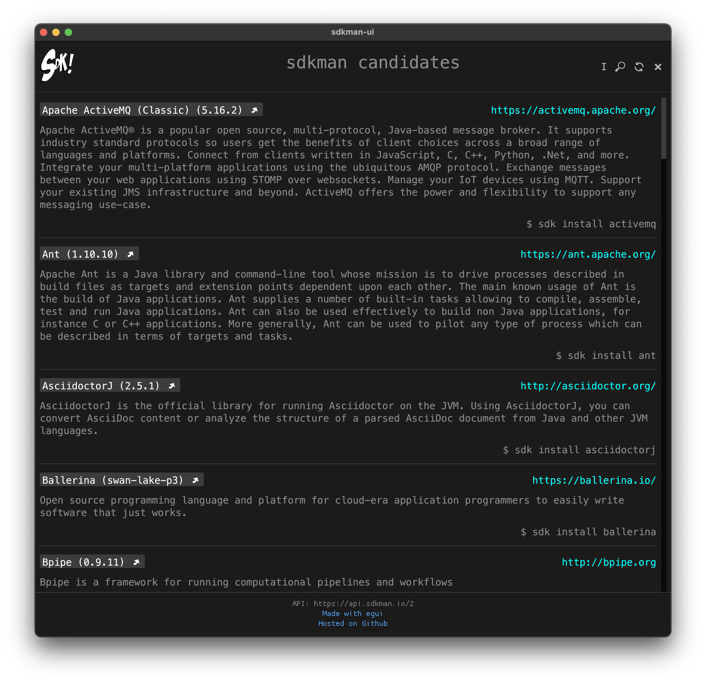

# sdkman-ui

Graphical user interface for [sdkman](https://sdkman.io/) written in [Rust](https://www.rust-lang.org/) using [egui](https://lib.rs/crates/egui) inspired by [Headlines](https://github.com/creativcoder/headlines.git) (purely educational project).

